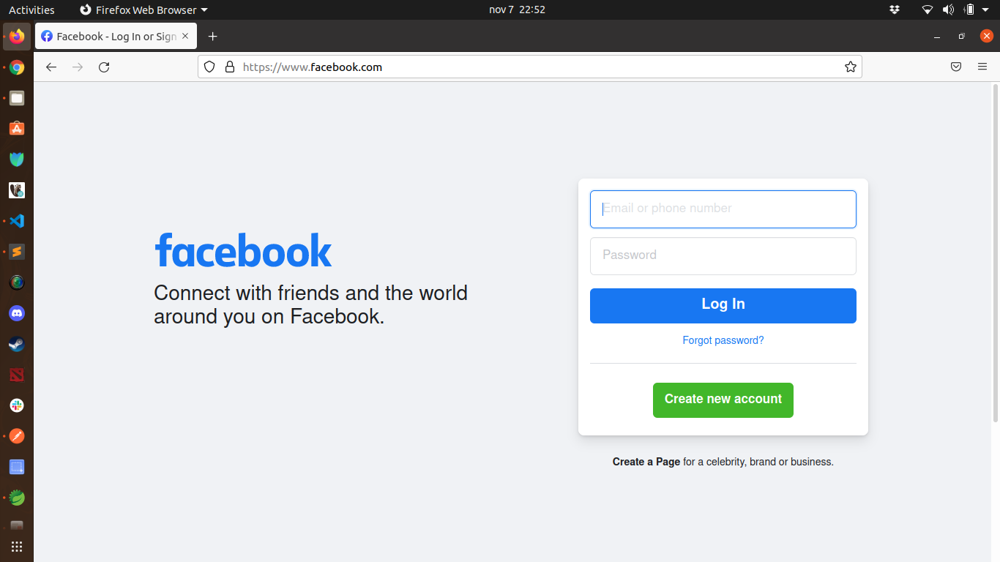

# Web Proxy

## 1. Technical Information

The project is made in Spring Boot Framework 2.5.6, with the following spects and dependencies

| Item | Description |
| ------ | ----------- |
| Springboot starter-parent   | v2.5.6 |
| Java   | v11 |
| Package | jar |
| embedded server    | Apache Tomcat |
| lombok    |  |
| logs    | library log4j2 |

Web specifications

| Item | Description |
| ------ | ----------- |
| domain   | /proxy |
| default port   | 8000 |
| protocol   | http |
| endpoint   | redirect-web with query param 'target'|

## 2. Running the application

First lets build the application with 'maven', the following command is going to create a 'target' folder where the '.jar' will be package:

    mvn package

Inside the created 'target' folder there should be a '.jar' file with name 'LeanTeach-Proxy-0.0.1-SNAPSHOT.jar', lets execute it with the folling command:

    java -jar LeanTeach-Proxy-0.0.1-SNAPSHOT.jar

Now the application should be running:

## 3. Calling the web-proxy service

## 3.1 REDIRECT

For calling the web proxy server, just go to your browser and type this addres:

    localhost:8000/proxy/redirect-web?target=<<YOUR_WEB_PAGE>>

Replacing the <<YOUR_WEB_PAGE>> by the webpage you would like to access by the proxy, as an example lets proxy to facebook:

    http:://localhost:8000/proxy/redirect-web?target=https://www.facebook.com

Results:

Calling the url:

Obtaining a http response code 302 for redirecting

Getting the desired web page

### 3.2 (REQUEST)

The proxy can also redirect request that would consume a web method different from a GET:

## 4. Application Logs

The aplication logs in console the request and response information:

Request:

Response:

## 5. How does it work

## 6. Application architecture

The application follow a strict desing patter, with layers: controller, services, client and utilities:

6.1 The interface between the ProxyService and the RestClient, produce a low coupling
relationship in the project, making it posible to use a new implementation from a client at any desired moment.

6.2 The mapper in utilities, have the resposability to create the dto's needed when calling a methods contract, spefifically transforming the request and response from the controller and the client.

6.3 The Logs responsability are separated in a exclusive service bean, making the application more scalable and maintainable, following the first SOLID principle of single responsability.

6.4 The HttpException class let the application to control the http status code returned to the client when controlling an specific exception.

6.5 The project classes and packages have the following structure:

## 7. Unit testing

The application runs some unit testing in JUnit

